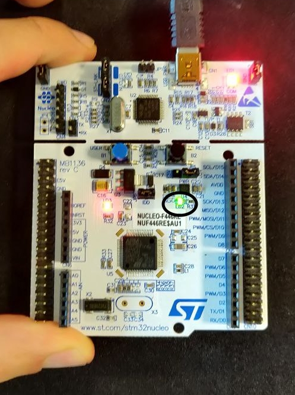
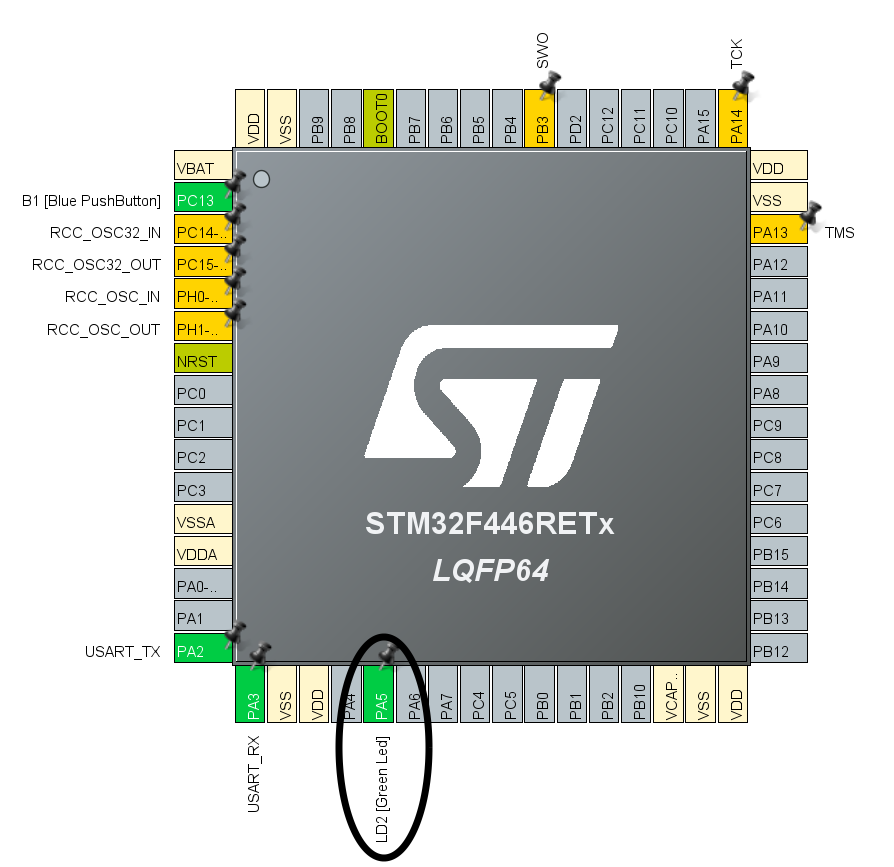
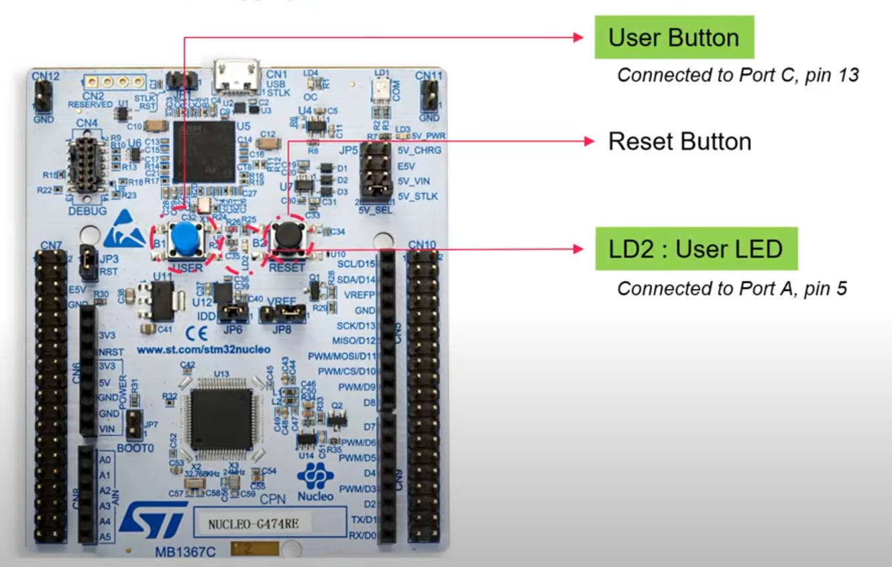
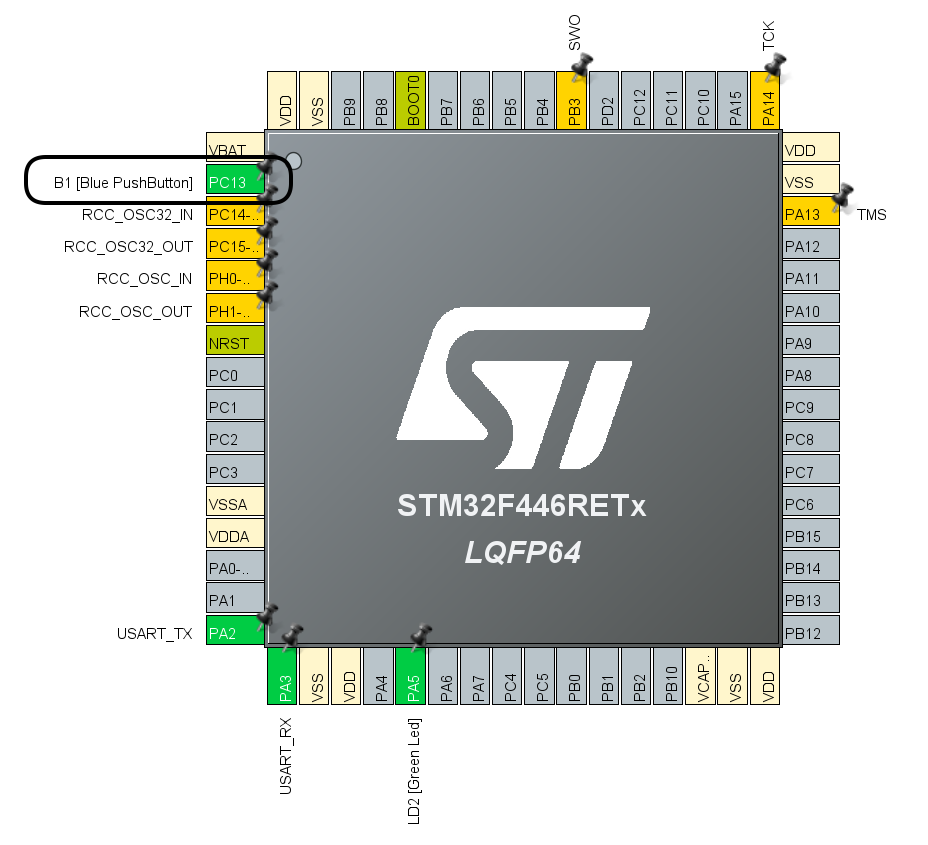

# Lab5-Peripherals

In this lab we will see how to deal with a real hardware, using a ST-Nucleo F446RE.


## Ex 1 - Getting Started 

The first lab experience will guide you through all the steps required to run application code on the STM32F446RE board. The project starts with the board configuration on STM32CubeMX. After that, following the steps, STM32CubeIDE will be automatically opened and you can start develop your code.

First, you will create a baremetal application to send strings over the UART. After that you will see how to manually add FreeRTOS to your project. You can find the FreeRTOSConfig.h and an example of a main.c.

PAY ATTENTION: the lab is structured to work with ST tools, so to write code through the specified IDE (STM32CubeIDE). If you want to try custom solutions, like using Visual Studio Code or similar, there could be issues and it is up to you to solve them, they are not covered in this lab session.


## Ex 2 - Blink Led
In this exercise, we will see a simple Led program.
The ST-Nucleo has many different Leds; in this example, we will use the LD2 (highlighted in the image).
This LED has been connected to `Pin 5 of Port A`.

Board View             |  Pinout perspective
:-------------------------:|:-------------------------:
  |  

The goal of this exercise is to create a simple Task in FreeRTOS that is able to switch on and switch off
the Led, to phrase the `SOS` signal in Morse code `▄ ▄ ▄ ▄▄▄ ▄▄▄ ▄▄▄ ▄ ▄ ▄` where the single `▄`
takes 0.5 seconds, and the long one `▄▄▄` takes 1.5 seconds; the intervals instead take 0.25 seconds.
The SOS signal must be repeated in an infinite loop; between each iteration, a timeout of 3 seconds to
separate two different messages.

We can start with the FreeRTOS Helloworld project created in exercise 1.
Before to start we need to check on which pin the LED 2 (LD2) is connected, to do that we can open
the Pinout & Configuration prespective, double clicking on the `.ioc` file.
Here we can see each component where is collegated. In particular LD2 is collegated with `PA5` that
means `Pin 5 of Port A`.

To turn the pin voltage high and turn on the led, we can use the function:
```
HAL_GPIO_TogglePin(port, pin_number)
```
As parameters, this function takes macros; for port A, we can use the macro `GPIOA`; instead, for
the pin_number, we can use the macro `GPIO_PIN_5`. Thanks to this function we can both turn the led
on if it is off and turn it off if it is on.

## Ex 3 - Button
This exercise will show how to use the board button inside our FreeRTOS program.

In particular, we will work with the user button `B1`, the blue one, which is connected to `Port C, pin 13`.

Board View             |  Pinout perspective
:-------------------------:|:-------------------------:
  |  

The button works in the following way:
- when it is pressed, the pin is connected to the ground, and the logical value is zero
- when it is not pressed, the pin is connected to the power supply, and the logical value is one.

In this exercise, create a task in FreeRTOS that, in an infinite loop, checks the
value of the button in every iteration, and if it is, press the switch on the LED. Otherwise, if it is not, press switch off
the LED. (use the LD2)

To do that, use the function to read the value of a specific PIN:
```
HAL_GPIO_ReadPin(Port, pin)
```
This function returns the macro `GPIO_PIN_RESET` if the logical value is zero; otherwise, it returns
`GPIO_PIN_SET` if the logical value is one.

### Tip

For using the led instead of `HAL_GPIO_TogglePin,` it is also possible to use the function:
```
HAL_GPIO_WritePin(Port, Pin, logical_value)
```
Whereas logical_value is aspect one of the two Marco: `GPIO_PIN_RESET` or `GPIO_PIN_SET.`

### Ex 3.2

Now try to realize a FreeRTOS Task that is in charge of recording the logical value of the button
for a given amount of time (10 Seconds) and then using the LED to reproduce the value of the button:

-  When the button was pressed, the LED is switched on.
-  When the button was not pressed, the LED is switched off.

### Tip

To record the value of the button polling every 1 ms, read the value of the button and save it in a
proper data structure, at the end of the recording loop, start another loop for writing the value on
the pin of the LED every 1 ms.


